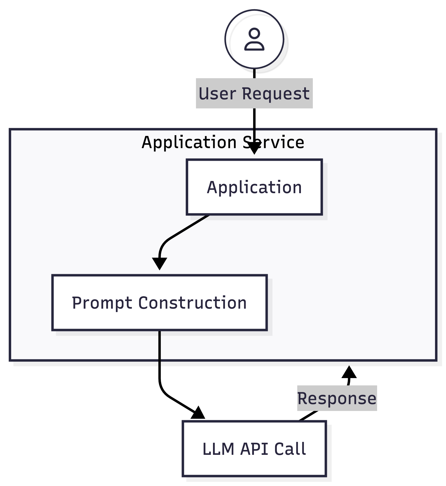
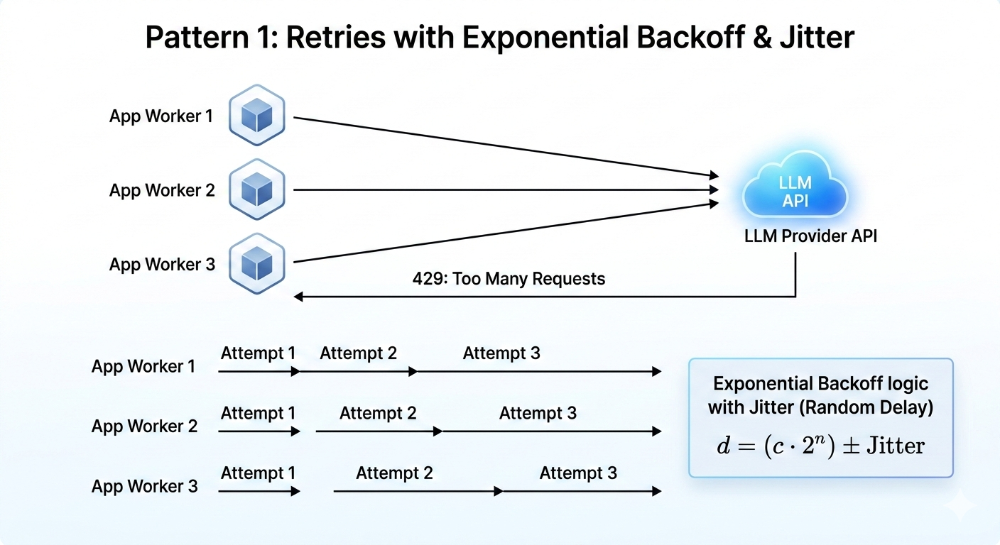
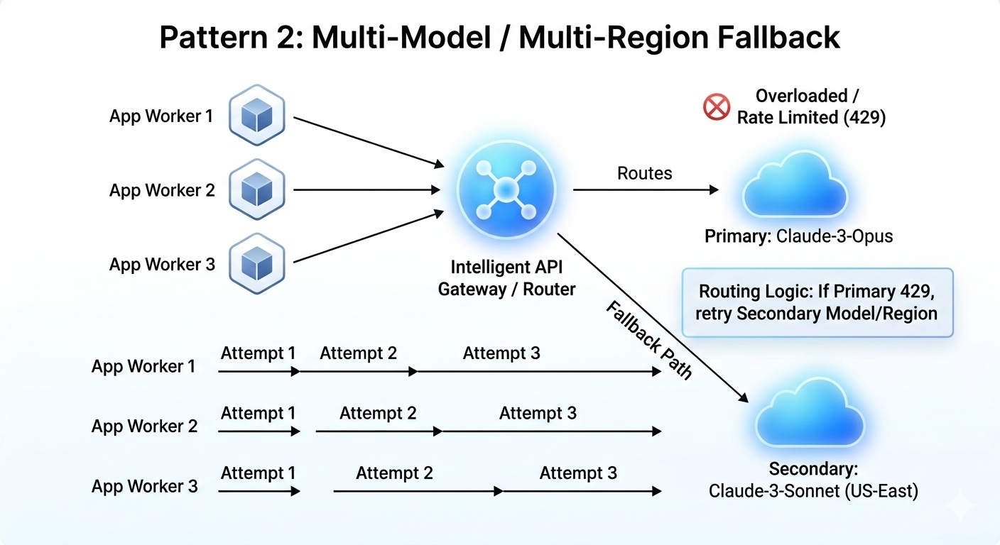
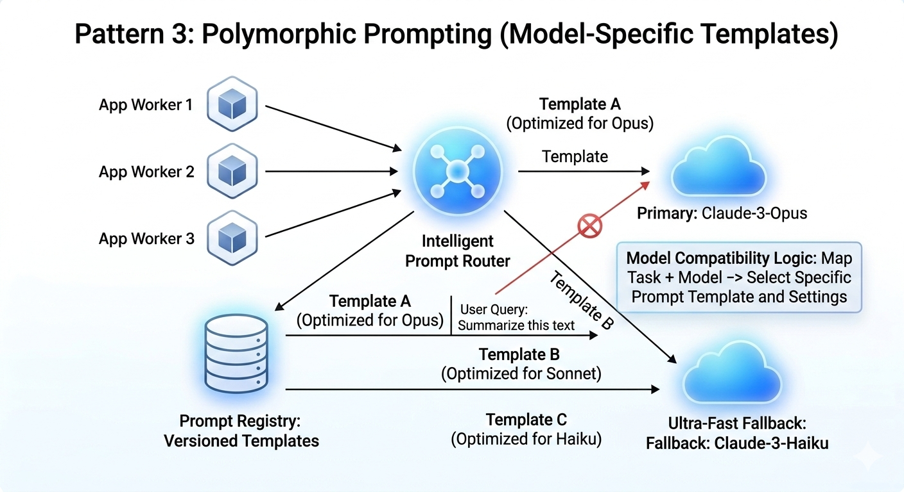
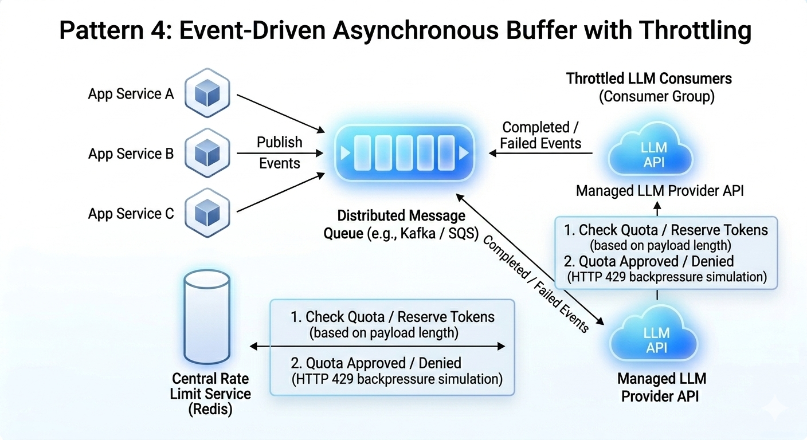

# Introduction

LLM adoption has reached a critical inflection point in the enterprise. While the majority of organizations rely on managed API providers to accelerate time-to-market, transitioning from experimental prototypes to business-critical production systems reveals a significant hurdle: upstream throughput constraints.

Managed LLM APIs abstract away infrastructure complexity but introduce a “black box” variable—rate limits. When multiple distributed services, background workers, and real-time user requests compete for a shared upstream quota, rate limiting ceases to be a simple client-side error and becomes a core systems-design constraint.

In this post we try and propose some solutions to the rate limiting problem when interacting with LLM providers.

# Problem Statement

LLM providers typically enforce multi-dimensional limits to maintain multi-tenant stability. These are usually defined by:

- RPM (Requests Per Minute): Limits the frequency of orchestrating calls.
- TPM (Tokens Per Minute): Limits the actual “compute” or payload volume.
- Concurrency: Limits the number of active HTTP connections.

These limits are generally existing to provide fair and consistent service to all their customers and ensure service stability. 

A sample LLM Application functions something like this

In a naive architecture, scaling traffic simply increases the probability of breaching these thresholds. Without sophisticated backpressure mechanisms, a burst in traffic doesn’t just slow the system down—it triggers a cascade of failures that can compromise the user experience and system reliability. The challenge is not handling individual failures but ensuring that the whole system remains resilient

Let us see few patterns which can help ensure the resiliency

## Pattern 1: Exponential Backoff

Exponential backoff is the simplest of resilient patterns to handle rate limiting, By rate limiting what the server is telling us is we cannot get any responses right now as we have exhausted the quota by a burst of traffic, So instead of constantly hitting the servers and asking it to serve we add a retry but in exponential time. That is the client waits for a progressively longer period after each subsequent failure.

However, Standard backoff is insufficient for distributed systems. If ten workers hit a rate limit simultaneously and retry on the same schedule, they create "thundering herd" spikes that re-congest the API. Introduce Jitter (randomized delay). This desynchronizes retries, smoothing out the request distribution and increasing the likelihood of hitting an open window in the provider's bucket.

## Pattern 2: Multi Model Fallback 

This is also quite simple to implement, Instead of just requesting one model which has limits have multiple LLM models from the same provider or different providers, for example if we are choosing claude-opus model and it is responding with 429 Too Many Requests, We should consider requesting a different model for example a Sonnet or Haiku Model or even a lower generation Opus model. 

The advantage to such a chage is that traffic is now distributed across models if one model is congested. While it maintains availability, it introduces output variance. A prompt optimized for a flagship model may produce hallucinations or formatting errors when executed on a smaller, faster model.

## Pattern 3: Multi Model Fallback with Appropriate prompts

To mitigate the downside of Pattern 2, the system should store versioned, model-specific prompt templates.

**Mechanism**: When falling back from a high-reasoning model to a lower-tier one, the application swaps the prompt for one with more explicit few-shot examples or stricter constraints to maintain output parity.

**Challenge**: This increases the maintenance surface area. You are no longer managing one LLM integration, but an “N-model” matrix that requires robust evaluation (Evals) to ensure consistent behavior across all fallback paths.

## Pattern 4: Event Driven Processing

By moving from a request response model we now ensure that there is no urgency to serve the response, We can control the following things by moving to a queue based model

**Backpressure Absorption**: The queue acts as a shock absorber for traffic spikes.

**Concurrency Control**: You can limit the number of active consumers to exactly match your provider’s Tier limits.

**Prioritization**: You can route “Premium User” requests to a priority lane while background tasks wait for available quota.

# Conclusion

External AI providers are distributed systems with shared, limited capacity. To build at scale, we must treat rate limits as a first-class architectural constraint rather than an edge case.

Successful LLM platforms do not just retry; they orchestrate. They distribute traffic across providers, control global concurrency, and ensure prompts are portable enough to survive a provider’s downtime. Retries may recover from failures, but architecture determines whether those failures happen in the first place.

PS: All diagrams have been generated with the use of AI Model (Gemini)
