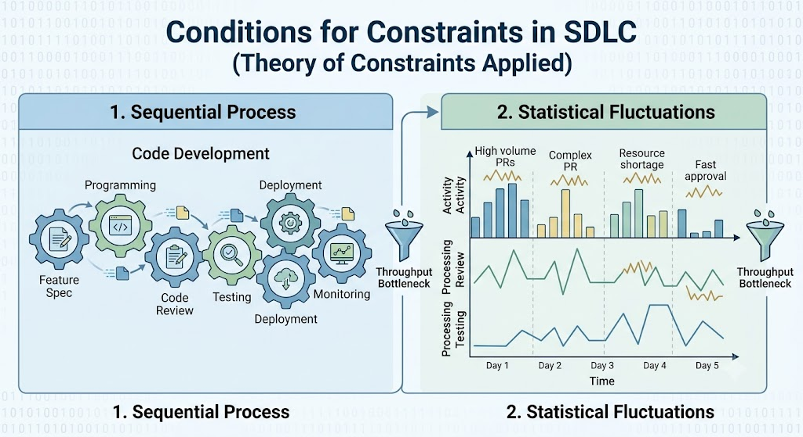
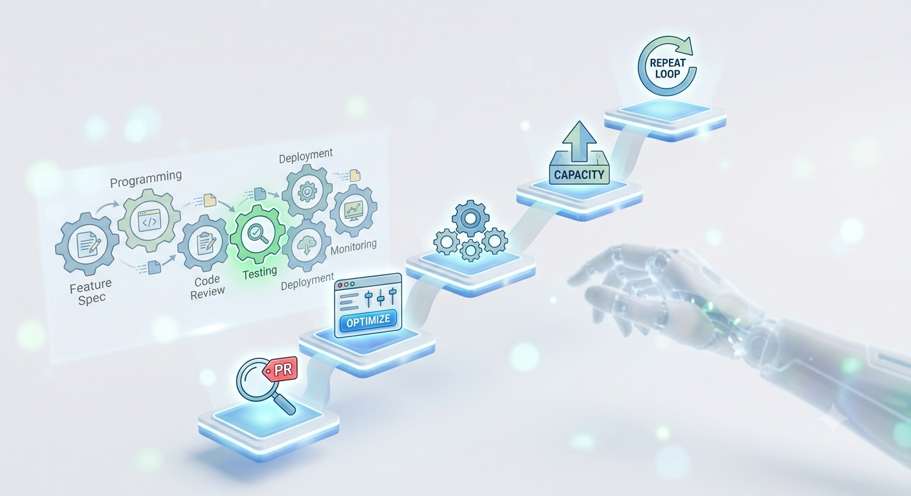

## Introduction
Recently I read a book called [The Goal](https://www.amazon.in/Goal-Improvement-Anniversary-Management-Bestseller/dp/B0HBX52HCW/ref=sr_1_1?crid=2WEJFKQFCI913&dib=eyJ2IjoiMSJ9.j9x9RpGQoYEts77GmLV--EJsEELuUEeVpjKjZnZ3DZL6mAO-aYo-IspbGIS8J9I5VP1KCpTS7rLHuELh8bdyGZNZpgzXGdfv6HnxJHzx7AaLy_XHNUtF6vxXtf8Dw0Apb-dTWvlitZp26aXbXXyKbQFmymrCnTK1TmlvgHWZfJapBtRfjeks203XH5BATOMAVZ8KlWDz5LBHa8rnKN8hLkAaaLwB7VzZl3ba1427Co4.WE-bnxqEANAtuwY-Glc9-F3lajbAmH3DynMH2VzYq9M&dib_tag=se&keywords=the+goal+eliyahu+goldratt&qid=1788698517&sprefix=The+goal%2Caps%2C257&sr=8-1) by Eliyahu Goldratt

## Premise

The book follows a plant manager, Alex Rogo, his manufacturing plant for parts is under some pressure to deliver goods which were delayed by operations. Recently Alex had been part of an initiative which demonstrated exciting capabilities by a robot on plant floor and that promised to increase the output. While the initiative was a success and robot was efficient the manufacturing plant as a whole was suffering from delays and Alex's boss Bill Peach has handed him a deadline to improve the plant over 3 months or let the plant close completely. Alex then accidentally meets his former professor, Jonah who then helps Alex solve the problem. 

## Takeaways

While this is a story about a plant manager and him optimizing certain flows in his manufacturing plant, I could relate very much to the Software Development Lifecycle and optimizing a backend request both of which have a similar structure to that of a manufacturing plant. 

## What conditions must exist for a process to have constraints

Any process must have the two conditions for theory of constraints to apply to it

1. It must be a sequential process
2. There must be statistical fluctuations between each of the steps

## Theory of Constraints 

The book basically talks about a theory of constraints where the end goal is to improve the performance of the entire system by focusing on a small number of constraints also known as bottlenecks. These bottlenecks are responsible for throughput or completion of value delivery chain. 

### Agentic SDLC analogy
Previously, in the SDLC, the programming process often consumed the most time and was therefore a bottleneck.because a lot of thought had to go into the implementation and then the code had to be reviewed, tested and then deployed. In the age of AI the bottleneck of programming has been largely moved to coding reviews or testing process which are downstream. This made me think about how to focus on delivery and ensuring that we increase the throughput of value delivery of work while not overwhelming certain parts of pipeline. 

There is a part in the book where Alex asks certain machines in the plant to remain idle if they have supplied enough for the bottleneck capacity. This made me think about Coding reviews as bottleneck and that we should be implementing only so many PR's that can be reviewed and pushed forward. Having a large number of open PRs will overwhelm and pressurize the entire system. 

While agents can churn code and even do code reviews to a certain extent the bottlenecks will be moving. So we have to be weary of what the bottleneck is before even promising anything to management or business. 

## How to exploit the bottleneck

There are basically 5 steps that one must follow to exploit the existing bottleneck

1. Identify the system constraint
2. Exploit the system constraint 
3. Subordinate everything else to the constraint
4. Elevate the constraint 
5. Repeat step 1-4 to avoid inertia

## Conclusion

What I found most interesting about *The Goal* is that the Theory of Constraints is not really about manufacturing. It is about understanding how a system behaves when work flows through a series of dependent processes.

Software engineering is no different.

We often try to make individual parts of the engineering process faster — write code faster, improve CI, automate deployments, or now, use AI agents to generate code and even perform reviews. But making one part of the system faster does not necessarily make the entire system faster. If anything, AI-assisted development may make this more apparent by moving the constraint downstream to code review, testing, security validation, deployment, or even decision-making.

The question then becomes less about *"How can we make developers produce more code?"* and more about *"What is currently limiting the flow of valuable software through the system?"*

That is the perspective from *The Goal* that I want to carry into software engineering.

**AI may make the production of software faster, but it does not automatically make the delivery of software faster. It may simply expose the next constraint.**

And perhaps that is the real lesson of the Theory of Constraints for an increasingly agentic SDLC: **don't optimize the parts in isolation. Find the constraint, improve the system around it, and then be ready to find the next one.**

