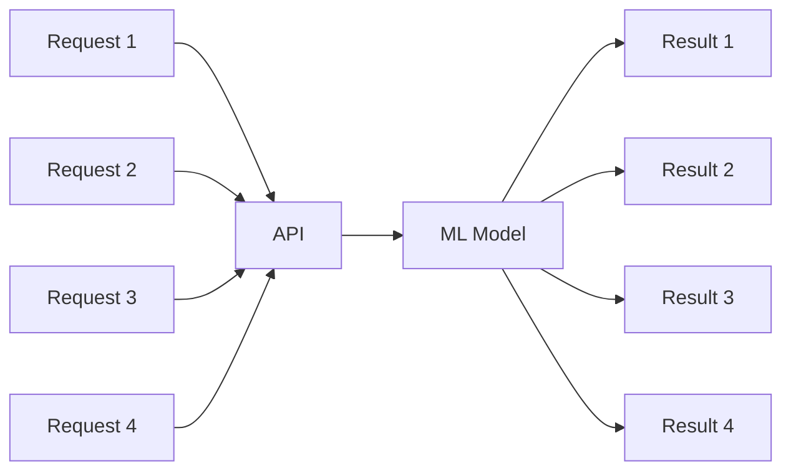
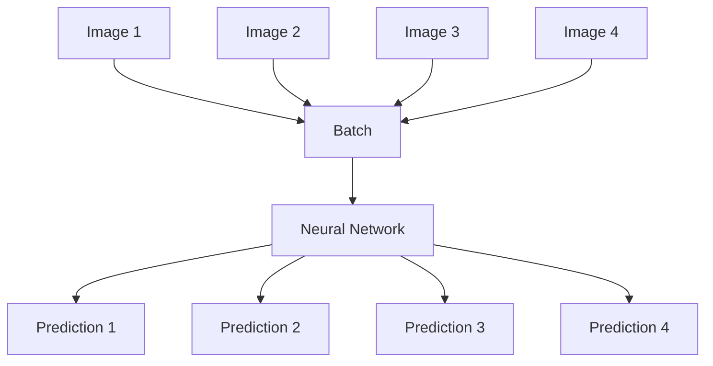

## Introduction

Often the most cool thing to do is to train a model from a dataset which can work on a particular domain or across the board like LLMs. This is extremely cool as you are literally putting together abstractions which can learn from the world. However once a model is trained how to ensure that it serves the customers or people that it is meant to serve? 

The next step to the training process is inference where we just obtain the input data and run predictions and provide the output to the users, this can be done in two ways 

1. Online inference
2. Offline inference (Batch inference)

Online inference is when a model is hosted in a server somewhere and can provide immediate predictions to us, Offline inference or batch inference is when we don't need an immediate answer but can send the inputs to the model in large batches and then wait for the inference. For offline inference we can just host it as a cron job or batch job which runs on a batch of data and provides results. Whereas online inference which is the most common requires us to build some kind of server HTTP/gRPC around the model and then provide the predictions. 

## Problem Statement

Let us consider a very simple model of Image classification, We have trained a model which needs to take an image as input and then provide class among the known classes as the output. At that point, it is tempting to think of the problem as a fairly conventional web application:

POST /predict
       │
       ▼
    Model
       │
       ▼
   Prediction

A framework such as FastAPI makes this particularly easy. We receive an image, run inference, and return the result. But there is an important difference between serving a machine learning model and serving a typical CRUD application.

A CRUD application is primarily concerned with handling requests efficiently. A machine learning inference server is ultimately concerned with feeding expensive compute efficiently.

That distinction becomes particularly important when the model is running on a GPU.

A GPU doesn't become more efficient simply because we send it more HTTP requests. It becomes more efficient when we give it work that can be executed in parallel.

## Batching

A traditional web application might look something like this:


Each request is largely independent.

For example:
```
GET /users/123
POST /orders
PUT /profile
DELETE /cart/item
```
The application is designed around individual requests.

Machine learning inference is different.

Consider:



The requests may be completely independent from the application's point of view, but their computation is often structurally identical.

For our Image classifier:

```
Image 1 → classify 
Image 2 → classify 
Image 3 → classify
Image 4 → classify
```
There is no fundamental reason that these computations have to be executed one at a time.

We can instead construct the payload to be:
```
[
    Image 1,
    Image 2,
    Image 3,
    Image 4
]
```
and give the entire collection to the model in one operation.

That is the basic idea behind batching.


The model can exploit the parallelism available in the underlying hardware.

This doesn't necessarily mean that processing four images takes exactly the same amount of time as processing one image.Instead, it means that the cost per request can decrease as we process larger batches which basically means optimal utilization of resources involved such as GPU. **The Basic idea is that batching improves throughput while increasing latency slightly**

However asking the client to change the payload from a single image to multiple images doesn't solve the problem when there are multiple clients. In that case the above batching technique also known as static batching isn't sufficient. 

## Dynamic Batching 
