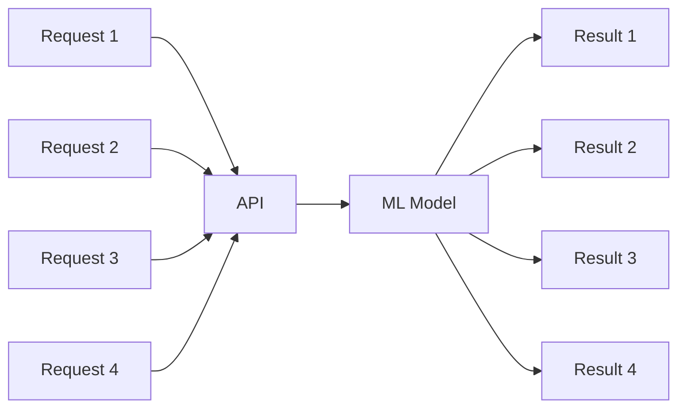
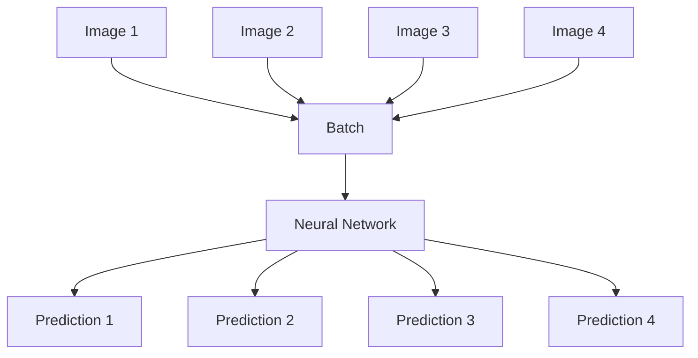
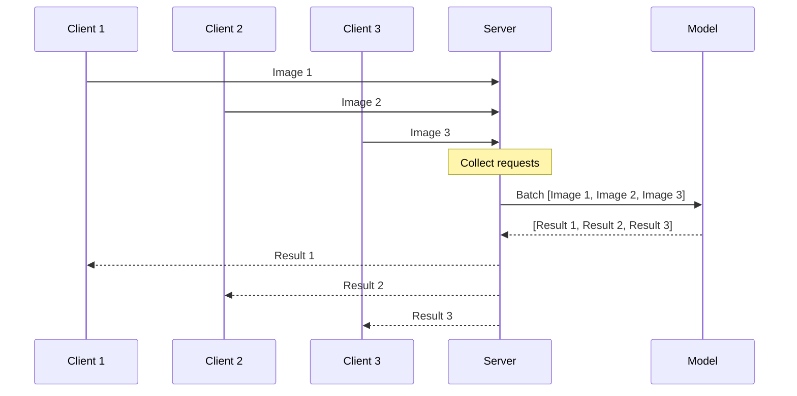
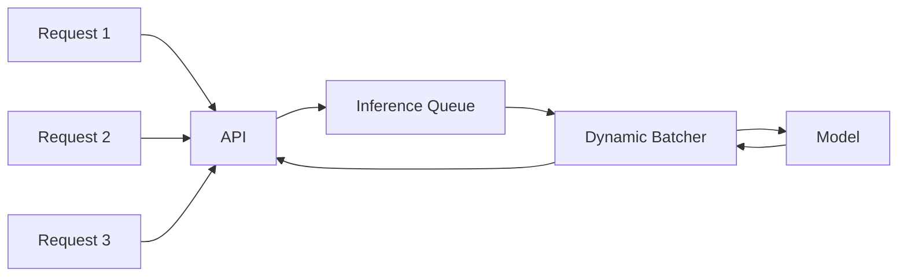
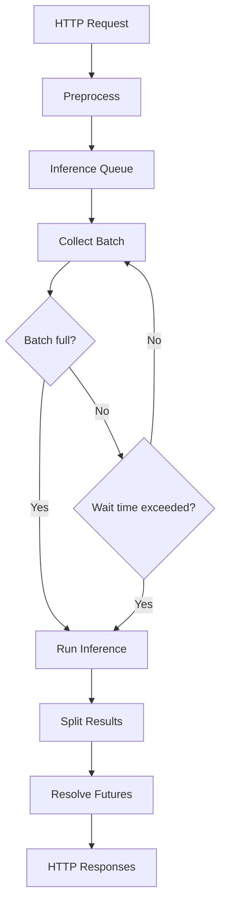

## Introduction

One of the most exciting aspects of machine learning is training a model on specialized datasets or building general-purpose foundation models like LLMs. Putting together architectures that learn from the world is fascinating work. However, once a model is trained, how do we efficiently serve it to end users?

The next step in the machine learning lifecycle is inference, where we feed input data into our trained model, run predictions, and deliver the output. Inference generally falls into two paradigms:

1. Online inference
2. Offline (Batch) inference

Offline (or batch) inference is used when immediate predictions aren't required. Input data can be collected over time and processed in large periodic runs via cron jobs or distributed batch pipelines.Online inference—the more common pattern for user-facing applications—requires hosting the model behind an API server (using HTTP or gRPC) that yields immediate predictions on demand.

## Problem Statement

Let us consider a very simple model of Image classification, We have trained a model which needs to take an image as input and then provide class among the known classes as the output. At that point, it is tempting to think of the problem as a fairly conventional web application:

POST /predict -> Model -> Prediction

Frameworks such as FastAPI make implementing this pattern straightforward: receive an payload, execute inference, and return the HTTP response. However, serving a machine learning model differs fundamentally from serving a typical CRUD application.

A CRUD application is primarily concerned with handling I/O requests efficiently. A machine learning inference server is ultimately concerned with feeding expensive compute efficiently.

That distinction becomes crucial when running models on GPUs. A GPU does not become more efficient simply by handling more HTTP requests concurrently; it becomes more efficient when given computations that can be executed in parallel tensor operations.

## Batching

A traditional web application might look something like this:


Each request is largely independent and executes separate business logic

For example:
```
GET /users/123
POST /orders
PUT /profile
DELETE /cart/item
```
The application is designed around individual requests.

Machine learning inference is different.

Consider:



Although the requests come from independent clients, their computational graph is identical:

```
Image 1 → classify 
Image 2 → classify 
Image 3 → classify
Image 4 → classify
```
Instead of executing these computations sequentially, we can group the inputs into a single tensor array and feed the entire collection to the neural network in a single matrix multiplication operation.

We can do this by constructing the payload to be:
```
[
    Image 1,
    Image 2,
    Image 3,
    Image 4
]
```
and give the entire collection to the model in one operation.

That is the basic idea behind batching.


The model can exploit the parallelism available in the underlying hardware.

Note on Data Shapes: When batching inputs like images of varying dimensions, inputs must be preprocessed and scaled or padded to identical dimensions to assemble a uniform tensor shape (e.g., $[B, C, H, W]$).By exploiting the parallel processing capability of hardware acceleration, the compute cost per request drops dramatically as batch sizes grow. The fundamental trade-off of batching is higher throughput in exchange for a slight increase in latency. Asking individual clients to send bulk payloads (known as static batching) is unfeasible when multiple independent users hit your API. We need a server-side strategy.

## Dynamic Batching 
Dynamic batching is a process which enables the clients to still send single requests instead of static batches, however the server takes care of batching by waiting for a small amount of time and then batching the requests from multiple clients together. This enables efficient resource utilization on the server side without putting the onus on the clients to send batches. 



Dynamic batching balances two primary operational conditions:
1. Batch Size Threshold: Immediately executing inference once incoming traffic fills the configured maximum batch size (max_batch_size).
2. Timeout Threshold: Triggering inference on whatever items have accumulated once a time window (max_wait_ms) expires, preventing early requests from waiting indefinitely.

The above behavior ensures that client doesn't wait indefinitely if the queue is not full and they are also not responsible for sending multiple items to the server they can send as small a request as possible. 

## Implmentation of Dynamic Batching on FastAPI server

The naive implementation of a fastapi server looks like this


Through this implementation as each request comes in every request is treated as a separate item input instead of batching. 

### Introduce a Queue

To support batching, we decoupled API endpoint handling from model execution by placing an asynchronous queue (asyncio.Queue) between them.


### Implement the dynamic batcher

The batcher worker collects incoming jobs until the batch size fills or the maximum wait deadline passes:

```python

import asyncio
import time


class DynamicBatcher:

    def __init__(
        self,
        model,
        max_batch_size=16,
        max_wait_ms=5,
    ):
        self.model = model
        self.max_batch_size = max_batch_size
        self.max_wait_ms = max_wait_ms

        self.queue = asyncio.Queue()

    async def submit(self, job):
        await self.queue.put(job)

    async def run(self):

        while True:

            batch = await self.collect_batch()

            await self.run_inference(batch)

    async def collect_batch(self):

        batch = []

        # Wait for the first request.
        first_job = await self.queue.get()
        batch.append(first_job)

        deadline = (
            time.monotonic()
            + self.max_wait_ms / 1000
        )

        while len(batch) < self.max_batch_size:

            remaining = deadline - time.monotonic()

            if remaining <= 0:
                break

            try:

                job = await asyncio.wait_for(
                    self.queue.get(),
                    timeout=remaining,
                )

                batch.append(job)

            except asyncio.TimeoutError:
                break

        return batch
```
Running heavy neural network compute or GPU context calls directly inside Python's main event loop can freeze async request intake. Wrapping inference calls with asyncio.to_thread or running them via worker processes keeps the API response handlers responsive. 

After the implementation of a dynamic batcher the implementation looks like 


### The endpoint code

The endpoint implemented with the dynamic batching will look something similar to this

```python
@app.post("/predict")
async def predict(file: UploadFile):

    image = await file.read()

    tensor = preprocess(image)

    loop = asyncio.get_running_loop()

    job = InferenceJob(
        request_id=str(uuid.uuid4()),
        tensor=tensor,
        future=loop.create_future(),
    )

    await batcher.submit(job)

    result = await job.future

    return {
        "prediction": result
    }
```
## Conclusion

Dynamic Batching is a tradeoff between Latency and Throughput. While waiting for a small period of time we might incur additional latency cost. Dynamic batching is not something that needs to be implemented out of box, if our server has spiky loads or large amount of requests that need to be served then dynamic batching can increase the throughput while making a small sacrifice in latency. If the number of requests are less (in the order of hundreds per day) or response time is crucial for the end application then dynamic batching is not necessary.

Dynamic batching becomes more useful in the case where GPU utilization is a key concern. GPU's consume a lot of resources to stay warm and active and sending single requests to them will heavily underutilize them and increase operational costs. So sacrificing latency to get a batch which can run is more useful for utilization purpose. 

While this blog post introduces Dynamic batching as a concept and an implementation it is notable that inference servers like Triton, vLLM, LitServe, PytorchServe etc come with Dynamic Batching enabled and more suitable for production workloads. 
